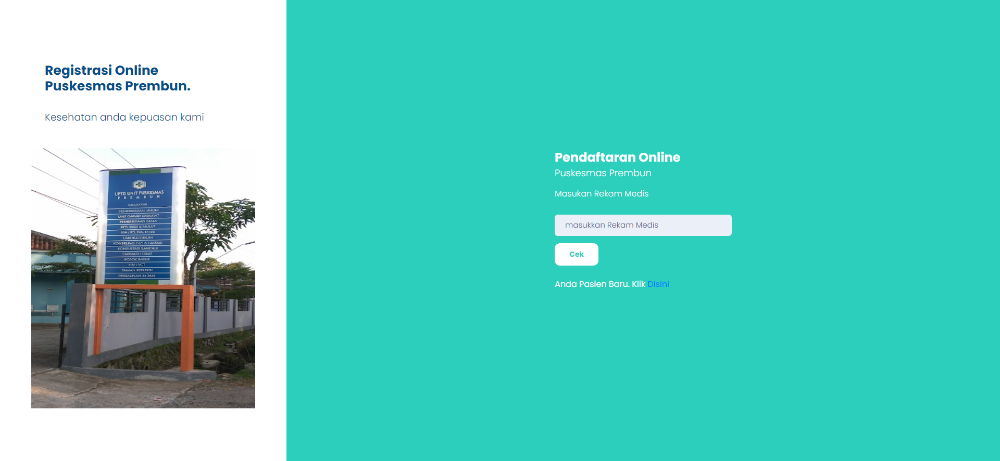
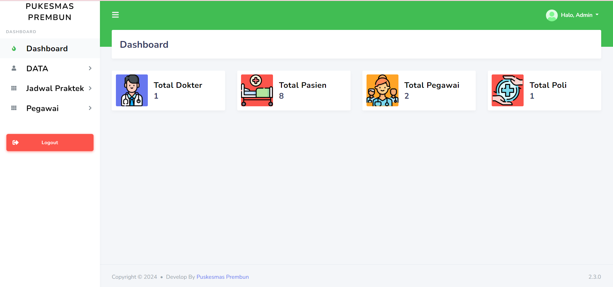
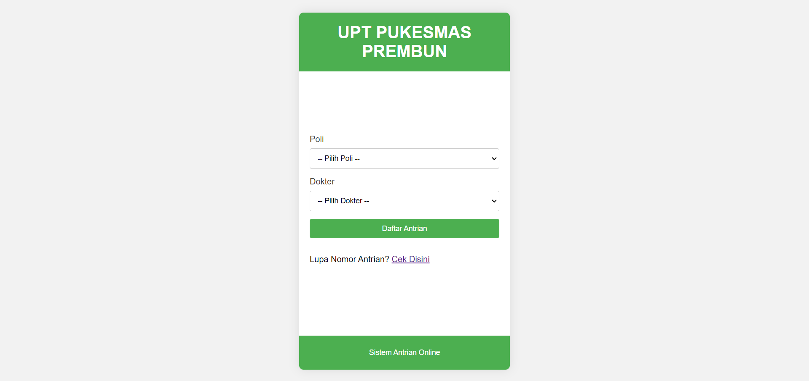

# Sistem Antrian Pukesmas Pasien Umum | Laravel + Bostraps

Sistem Antrian Pukesmas Untuk Pasien Umum

## Fitur

- Dashboard
- Daftar Petugas
- Data Pasien
- Data Jadwal
- Data Dokter
- Data Poli

## Teknologi

**Fornt-End:** HTML, CSS, JavaScript, Bootstrap 

**Framework:** PHP 8.2, Laravel 9

**Back-End:** MySql

## AKSES REPOSITORY

## Screenshots

**HALAMAN HALAMAN UTAMA** 

**HALAMAN DASHBOARD** 

**HALAMAN ANTRIAN** 

## Feedback

Berikan feedback atau Ingin Memproleh SourceCode:

